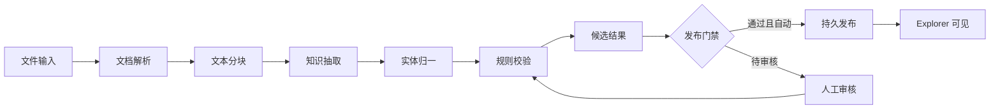
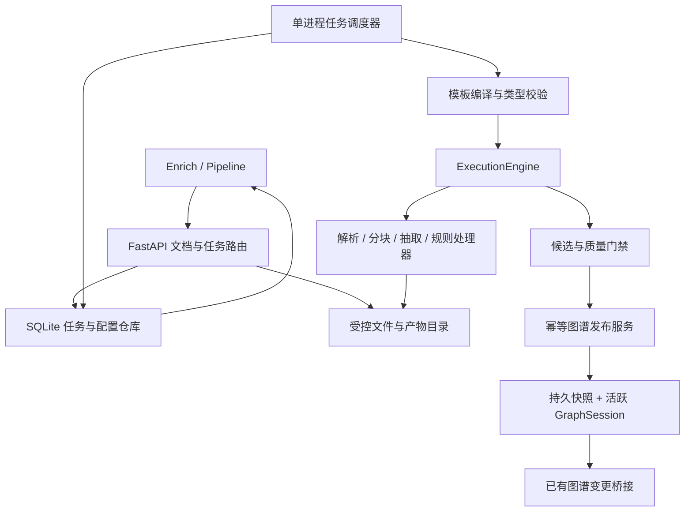

# Semantica 文档 Pipeline 工作台设计 Spec

- 日期：2026-09-08
- 状态：设计稿，可据此拆分开发；本文中的新增 API、页面和存储协议尚未实现。
- 配套：[落地方案](../plans/2026-09-08-document-pipeline-workbench-plan.md)
- 目标用户：知识库维护人员、抽取规则维护人员；初期沿用 Explorer 单工作空间与 API Key 权限模型。

## 1. 目标与范围

### 1.1 已确认的需求

| 编号 | 需求 | 最终用户行为 |
| --- | --- | --- |
| R01 | 单次操作自动完成 | 首次配置后，选择一个文档，点击“上传并运行”，自动走到图谱发布或明确的异常状态 |
| R02 | 节点式可视化 | 通过端口和连线识别依赖；支持拖动、缩放、适应画布、步骤配置 |
| R03 | 项目视觉一致 | 在 Enrich 中新增 Pipeline，复用当前 SKE 导航和工作区样式 |
| R04 | 真实状态 | 节点状态、数量、错误和最终结果均来自后台任务，页面刷新不丢失 |
| R05 | 可配置模板 | 调整流程模板、抽取提示词、类型、输出字段和正反例，保存独立版本 |
| R06 | 可执行规则 | 配置实体归一、字段校验、状态与关系约束，查看规则触发原因 |
| R07 | 结果不满意可迭代 | 看证据、人工修订、改模板或规则、重跑受影响步骤、对比新旧结果 |
| R08 | 真实发布 | 校验或审核通过后才写入目标知识库，成功后能在 Explorer 查看和追溯 |
| R09 | 可验证可复现 | 固化文档、模板、规则、模型参数和处理器版本，保留历史与评测结果 |

“微调”在本项目中首先指模板、规则、参数和人工修订；训练或微调模型不属于本期。

### 1.2 产品决策

1. 默认策略为 `auto_if_clean`：无阻断项、无待审核项时自动发布；有问题停在审核，不静默丢弃后发布。
2. 提供 `manual` 策略：每次由人确认发布。该策略是用户预先选择，不在所有运行中强制增加确认操作。
3. 每次运行先生成独立候选结果；调整提示词和重复运行不直接污染当前图谱。
4. 完整 v1 支持类型兼容的串行流程编辑，不支持任意分支、条件和并行连线；通用 DAG 列入 v2。
5. 单文件优先。完整 v1 覆盖 DOCX、TXT、Markdown、文字版 PDF；M1 先仅 DOCX。扫描件 OCR、复杂表格不假装支持，识别后明确阻断或提示缺失内容。
6. 本期“完成”指图谱发布成功并可见；向量索引、RAG 问答、外部 Neo4j/FalkorDB 写入是独立扩展目标，不用图谱完成代替它们。
7. 先支持单个 Explorer 服务进程、本地持久化目录和单个活动任务。多用户、分布式队列和多进程 worker 不属于首发部署承诺。

### 1.3 交付层次

| 层次 | 内容 | 对外口径 |
| --- | --- | --- |
| 现有原型 | 独立 HTML 节点画布、模拟执行 | 仅交互参考 |
| 已完成验证 | Python 脚本读取 DOCX、真实抽取、规则处理、本地图谱 | 本地链路可行，无网页任务服务 |
| M1 | 上传、任务、持久状态、候选图谱 | 可运行的端到端候选生成，不等于入库完成 |
| 完整 v1（M1-M4） | 真实画布、可编辑模板规则、审核发布、版本重跑和对比 | 满足 R01-R09 的首个产品版本 |
| v2 | 分支并行、批量、外部存储、OCR/向量/RAG | 单独立项验收 |

## 2. 现状与证据

| 模块 | 已有能力 | 需要补齐 |
| --- | --- | --- |
| `semantica/pipeline/pipeline_builder.py` | 步骤、依赖、handler 注册、结构校验 | HTTP 可提交的受限流程定义、端口类型和必需阶段校验 |
| `semantica/pipeline/execution_engine.py` | 顺序执行、有限并行、步骤状态、结果、重试 | 持久任务、隔离 run_id、完整事件、可靠终态、取消语义 |
| `semantica/pipeline/pipeline_templates.py` | 内置模板、自定义注册、参数覆盖 | 不可变版本、配置 schema、编辑与发布、覆盖时避免修改原模板 |
| `semantica/parse`、`semantica/split` | DOCX 等解析、分块工具 | 统一文档/块契约、稳定证据位置、文件特性预检 |
| `semantica/semantic_extract` | 模型封装、抽取、基础规则与校验 | 医院业务模板、结构化数量时间、语义约束、独立质量门禁 |
| `semantica/explorer/routes/export_import.py` | JSON/CSV 图谱导入 | 原始文档上传和文档任务 API |
| `semantica/server.py` | 另一服务入口，也挂载 Explorer 路由 | 共用任务生命周期/路由安装；现有 `/build` 是占位返回，不能作为本流程启动API |
| `semantica/explorer/session.py` | 活跃 ContextGraph、搜索、节点边操作 | 候选结果审核、幂等发布、持久化和崩溃恢复 |
| `semantica/explorer/ws.py` | `/ws/graph-updates` 图谱变更广播 | 文档任务事件不可直接等同于图谱事件 |
| `explorer/src/App.tsx` | Enrich、工作区壳、主题 token | Pipeline 工作区和子视图 |
| `explorer/package.json` | React 19、React Query、React Flow、Monaco、Lucide | 可复用现有依赖，不引入第二套画布库 |
| Ontology Hub / SHACL | 已有约束编辑、校验入口 | 需要显式 RDF 映射才能用于本流程；不能直接替代文本业务规则 |

重要限制：当前引擎串行执行将 `current_data` 依次传给下一步骤，拓扑排序不代表任意端口的数据路由。配置 `retry_on_failure=False` 不直接关闭当前重试循环，验证使用 `default_max_retries=0`。暂停/停止主要在步骤边界检查，当前执行汇总还可能覆盖停止终态。`GraphSession.add_nodes_and_edges()` 的锁不提供整批回滚事务。

实验依据：`scripts/verify_document_pipeline.py`；`output/document-pipeline-validation/20260908-120039/COMPARISON.md`。

当前 `ContextGraph.save_to_file()` 已有临时文件、fsync和原子替换，可以复用；它不提供活动内存图、任务数据库和快照之间的联合事务。产品编译器必须把“每个步骤均绑定合法handler”作为硬条件：引擎当前缺handler时会原样返回输入，不能把这种空操作算成真实完成。

| 实验 | 实体 / 关系 | 结果 |
| --- | --- | --- |
| 原始抽取 | 19 / 17 | 数量年份未结构化、合作运营状态错误、证据不完整 |
| 模板规则 v1.0 | 25 / 17 | 8 条关系被拦截，发现证据拼接、别名和方向问题 |
| 模板规则 v1.1 | 25 / 23 | 数量与年份独立保存；规则纠正一次运营状态；六步完成约 6.8 秒 |

这不是准确率基准：同一文档同时调整过提示词、字段、分块和规则。仍存在培训项目遗漏、120 岁数量缺失、别名消歧和语义证据不足。正式业务门禁必须能识别这些缺口，不能只展示“校验通过”。

## 3. 信息架构与界面

### 3.1 入口

保持左侧 SKE 主导航，在 `Enrich` 的 `Pipeline` 页签内提供四个子视图：

| 子视图 | 内容 | 主操作 |
| --- | --- | --- |
| 流程 | 模板选择、节点画布、文件和执行目标 | 上传并运行、保存流程版本 |
| 模板与规则 | 流程模板、抽取模板、规则集、别名字典 | 编辑草稿、样例试跑、发布版本 |
| 运行记录 | 状态、文档、版本、耗时、数量、失败步骤 | 打开任务、重跑、对比 |
| 结果审核 | 实体/关系表、原文证据、规则触发、修订 | 修订、排除、重新校验、确认发布 |

复用 Import and Export、Diff and Merge、Entity Resolution、Registry 的现有入口。Pipeline 结果审核承载文档证据和规则反馈，不能直接把已有通用实体合并页当成完整审核页。

### 3.2 工作区布局

- 顶部保留项目 `WorkspaceShell`、Enrich 标题、胶囊页签；流程工具条显示名称、草稿/发布版本、运行目标和命令。
- 中间 React Flow 无装饰外框画布，左侧按需展开节点库，右侧为选中节点参数面板，底部为可折叠执行记录。
- 节点显示稳定的名称、类型图标、状态、实际处理数量、耗时；未产生指标显示空值，不用示例数字补齐。
- 连线表达依赖，动画只在后台状态为运行中时出现。移动节点只改布局；改变连线必须重新做流程结构校验。
- 参数面板区分“编辑草稿”和“查看本次运行快照”。运行中不能修改其已固定配置。
- 运行完成后的“查看图谱”携带明确的 `graph_id`、revision 和本次 publish_id，不只切到当前随机图谱。

### 3.3 视觉与响应式

直接复用 `App.tsx` 的 `--ws-*` token、`ws-btn` 和 `workspace-tab`，不把原型里叠加的 CSS 搬入项目。强调色 `#4aa3ff`，工作区背景 `#060d1a`；绿色完成、琥珀警告、红色失败只作状态色。沿用现有字体与紧凑标题尺度、输入框和面板间距，节点建议 8px 圆角，主导航遵循现有样式。

React Flow 复用现有 OntologyEditor/LineageDiagram 实践；Monaco 用于 JSON 高级编辑，表单为默认入口；工具按钮使用 Lucide 图标、悬停提示和可访问名称。

桌面 >=1280px：侧面板约 300-360px，画布占剩余宽度；768-1279px：侧面板可折叠；窄屏：参数改为抽屉、记录为列表、工具条换行。所有视口保留“适应画布”和状态，不通过缩小字号把全部节点硬塞入首屏。首次排布可折行为纵向链，仍以连线表达真实依赖。

## 4. 核心用户流程

### 4.1 首次设置与自动运行

1. 选择已发布的流程/抽取模板和规则集；默认医院模板只适用于对应业务文档。
2. 选择服务器已配置的模型 profile、目标图谱与发布策略；预检模型依赖、解析能力、可写存储和流程类型。
3. 用户选择文档，点击一次“上传并运行”。前端先上传，再创建任务，这两个 API 不增加用户操作次数。
4. 上传、预检完成后后台排队执行；页面通过 run_id 自动更新节点，关闭页面不取消任务。
5. 自动发布策略且没有阻断/待审核问题：保存候选、持久发布、图谱可见后显示完成。
6. 有问题：停在 `awaiting_review`，列出原因和证据。修改模板/规则或人工处置后重新校验再继续。

### 4.2 对结果不满意

| 问题 | 修改位置 | 最早重跑步骤 |
| --- | --- | --- |
| 解析漏正文/表格 | 解析节点与解析器配置 | parse |
| 上下文丢失 | 分块节点 | split |
| 漏项目、关系类型不对 | 抽取模板的字段、示例、约束 | extract |
| 同义词/别名重复 | 归一规则和已确认别名字典 | normalize |
| 规划、运营、目标混淆 | 业务规则集 | validate；若需补抽取字段则 extract |
| 少量具体记录有误 | 结果审核的实体/关系编辑 | 审核修订后重新 validate |

任何重跑创建新 run，保留 `parent_run_id`，不覆盖旧任务。明确展示“将复用 2 个步骤、重跑 4 个步骤”和预期模型调用范围。对比展示新增、删除、字段变化、规则触发变化与来源变化，不能只比实体总数。

### 4.3 可编辑流程的边界

人工修订单条事实与“保存为通用规则”是两个独立操作，不能自动把局部修订提升为全局规则。新run不静默继承旧审核决议；提示旧修订与新输出的差异，重新校验并确认适用范围。

完整 v1 允许拖动、保存布局、修改参数、从注册节点库添加兼容的处理节点、删除可选节点和重新连接串行依赖。文件输入、解析、抽取、校验、候选保存和发布门禁不得绕过；不合法连接在拖线时提示，服务器再次校验。

首发不显示可用的并行分叉按钮，不接受未知节点或客户端上传 Python handler。高级用户也只能选择已注册处理器。v2 才增加多输入/多输出、显式端口绑定、条件、合流和并行错误语义。

## 5. 流程与数据契约

### 5.1 默认流程



图中的审核回路属于任务服务，不能编译为引擎 DAG 环。处理引擎执行到候选结果即返回，任务服务依据策略进入发布或审核；人工修订产生新的候选 revision 和校验执行。

### 5.2 类型化产物

| 产物 | 必要字段 | 约束 |
| --- | --- | --- |
| DocumentArtifact | document_id、sha256、媒体类型、块/段落、source span、解析器版本 | 不使用文件名作为唯一 ID；DOCX 段落不伪造页码 |
| ChunkArtifact | chunk_id、document_id、segment refs、上下文、分块参数 hash | 来源位置稳定，不能只保留无位置的字符串 |
| ExtractionArtifact | entities、claims、provider/model、usage、原始输出引用 | 模型返回先做 schema 校验，保留未修正输出 |
| NormalizedArtifact | canonical IDs、别名、变换记录、claims | 未确认别名或冲突不能无声合并 |
| CandidateArtifact | 节点、关系、证据、field issues、rule audit、review revision | 原始结果与人工修订分开保存 |
| GraphSnapshot | graph_id、revision、parent revision、publish_id、content hash | 只有发布事务确认后的快照才是知识库结果 |

步骤注册表声明 `step_type/version/input_type/output_type/config_schema/handler/retry_policy/cache_policy`。首发实际调用链只传 artifact 引用与受控上下文，不把整个文档和图谱反复复制到状态数据库。

### 5.3 业务字段与证据

候选图预览使用独立组件状态/查询缓存，不写入当前全局graphStore。只有选择已发布图谱后才刷新GraphWorkspace的正式数据源，避免“查看候选”改变用户正在浏览的知识库。

- 关系存 `status`，区分文档陈述、规划、建设中、已运营、目标；这是文档陈述的分类，不是医学事实认证。
- 数量保留原文，并规范为 `{raw, value, min, max, comparator, unit}`；例如 `2000+家` 保留 `raw` 与 `comparator=plus_unspecified`，不要擅自断定严格大于还是大于等于。
- 时间保留 `{raw, year, precision, role}`，例如 `2028年` 为规划年份，不补造月日。
- 证据使用 `document_id/segment_ids/char spans/quote`，quote 由服务端从原文提取。非连续段落分别保存，不把跨段拼接伪装成一句原文。
- 一个事实可有多个证据。事实 ID 基于规范实体、关系、状态与有效时间；独立 evidence_id 可避免去重时覆盖其他文档来源。
- 语义校验与字符串存在性校验分别报告；“证据在原文中”不能作为事实准确性的充分条件。

## 6. 模板、规则与审核

### 6.1 三类配置

| 配置 | 用途 | 版本变化影响 |
| --- | --- | --- |
| 流程模板 | 步骤拓扑、节点默认参数、发布策略 | 编译流程和受影响后继步骤 |
| 抽取模板 | 类型、输出 schema、提示词、正反例、语言和领域 | extract 及后继 |
| 规则集 | 状态、字段、方向、证据、别名字典、质量门禁 | 根据规则阶段从 normalize 或 validate 开始 |

每项有稳定 ID、独立不可变 version_id、schema_version、内容 hash、草稿 revision、说明和发布时间。发布版本不可编辑；修改创建草稿，验证后发布新版本。现有任务引用旧快照；弃用版本仍可查看，不删除被任务引用的内容。

草稿样例试跑固定本次draft revision及完整配置，创建 `purpose=preview` 的独立任务，允许真实模型调用并记录用量。预览任务只输出候选与质量报告，终态为preview_completed，任何publish请求都拒绝。预览通过后由用户发布配置版本，再正常创建生产run；不能原地把preview任务升级为正式发布。

配置优先级：受支持的服务能力上限 > 运行显式覆盖 > 节点参数 > 发布模板默认值。硬性证据/端点安全约束不能由普通覆盖关闭。运行时将最终配置物化为快照，页面能查看其来源。

### 6.2 规则格式和执行

规则是受限声明式数据，由注册 evaluator 执行；不使用 `eval()`，不执行来自模板的代码。复杂新逻辑需要开发者注册 evaluator，UI 不宣称能配置任意业务逻辑。

```json
{
  "id": "cooperation_not_operational",
  "version": "1",
  "phase": "validate",
  "evaluator": "relation_status_constraint",
  "params": {"relation_types": ["合作", "开设项目"], "allowed_statuses": ["文档陈述"]},
  "severity": "review",
  "action": "suggest_fix",
  "enabled": true
}
```

执行顺序：schema/来源与端点硬校验、实体归一、字段规范化、状态与关系语义、完整性检查、发布门禁。规则按阶段和固定优先级排序，不允许后面的规则静默覆盖前面的冲突修正。

| 动作 | 处理方式 |
| --- | --- |
| reject | 无合法证据或非法端点等，记录拒绝原因，不能进入发布集 |
| review | 证据冲突或不确定，等待修订或明确排除 |
| suggest_fix | 给出前后值和证据；审核确认后重新校验 |
| auto_fix | 仅已发布规则允许的确定性转换，记录原值/新值/规则版本 |
| warn | 不阻断但必须展示，不能隐藏为完全无问题 |

所有动作记录 rule_id/version、记录 ID、命中证据、before/after、reason。计划/运营判断必须绑定具体实体所在分句及否定、时间上下文，不能因同段出现“已运营”就给所有机构同一状态。无法判断时转 review。

完整性规则按模板定义预期类别、条件必填字段、孤立实体等；不把本次文档期望实体数量硬编码到通用规则中。

### 6.3 审核与发布门禁

默认 `auto_if_clean` 要求：schema 和引用全部合法；无未处理的 reject/review；所有必需字段满足；没有冲突合并；候选和目标 revision 一致。确定性 auto_fix 可通过，保留审计；warn 展示为完成带警告。

审核表支持编辑规范名称、关系方向、状态、字段、证据引用、排除记录。人工修订只改候选 overlay，重新验证后才能发布。拒绝记录可由用户明确排除并说明原因；这不是绕过硬校验批准非法记录。

一次任务默认整体发布；有未决问题不先发布另一半。这样一次运行对应一个明确图谱 revision，避免重跑时混入半批结果。

## 7. 任务状态与事件

### 7.1 状态定义

| 对象 | 状态 |
| --- | --- |
| run | queued、running、awaiting_review、publishing、completed、preview_completed、failed、cancel_requested、cancelled、interrupted |
| step | pending、running、retrying、completed、failed、blocked、cancelled、reused |
| quality | unknown、passed、warnings、needs_review、failed |
| publication | not_applicable（preview）、not_started、prepared、committed、activating、visible、recovery_required |

只有 `publication=visible` 且处理完成，run 才为 completed。生成候选但未发布可显示“候选已生成”，不得显示“入库成功”。工作线程宕机是 interrupted；未执行的下游是 blocked/cancelled，不能标为完成。

### 7.2 可靠事件

任务状态以 SQLite 记录为准；每次 attempt 的 started/completed/failed/retry_scheduled 等事件与步骤行更新同事务写入。通过包装 handler 和必要的引擎生命周期钩子记录，不靠 100ms 采样补事件；快速步骤也必须有完整开始/结束记录。

```json
{
  "run_id": "run_uuid",
  "seq": 12,
  "event": "step.completed",
  "step_id": "extract",
  "attempt": 1,
  "timestamp": "2026-09-08T04:00:00Z",
  "artifact_id": "artifact_uuid",
  "metrics": {"entities": 25, "claims": 23}
}
```

首版前端每 1 秒轮询当前 run 和 `events?after_seq=`；awaiting_review 降频，网络错误指数退避至 10 秒。run快照带 `last_event_seq`，终态和最终事件在同一事务提交；前端读到终态后继续追取事件直到达到该seq，才停止轮询。事件响应带next_seq/has_more/snapshot_last_seq，分页期间新增的事件在下一轮继续追取。断网显示连接状态，不改后台run状态；按seq去重，刷新从服务器重新读取，不能因先读到completed就丢失最后一批事件。

任务进度表示完成阶段数，不伪造模型 token 百分比或 ETA。模型缺少 usage 返回时显示未知。后续 SSE 是同一持久事件的传输优化，图谱 WebSocket 只负责发布后的图谱刷新。

### 7.3 重试、取消和重启

- 429、超时、暂时网络/服务错误允许有限重试，遵循 Retry-After，指数退避加抖动；401/403、schema/规则失败不无条件重试。
- SDK 自动重试与引擎重试统一预算，避免层层放大调用；模型完整性错误最多一次显式修复调用并记录费用。
- 一个 run 使用独立 Pipeline 实例和唯一 run_id 作为 engine pipeline.name，禁止复用带状态的模板对象。
- 取消为协作式：持久化 cancel_requested，步骤/分块边界检查；正在进行的模型调用按配置超时结束，不能承诺立刻杀死或退还费用。
- 已进入原子发布提交阶段不能取消；返回 409。已完成发布也不能伪装成取消，只能创建撤销/更正任务。
- 进程重启将失去租约的执行标 interrupted；可从已校验缓存创建恢复子任务，M1 不自动重发状态不明的模型请求。

## 8. 后端架构与持久化

### 8.1 组件



新增产品服务放在 `semantica/explorer/pipelines/`；通用引擎只增加可复用生命周期和正确性修复。业务 prompt 不写入 `execution_engine.py`。实验脚本不成为 FastAPI 路由中的直接可执行命令。

### 8.2 本地部署

建议新增 `SEMANTICA_PIPELINE_DATA_DIR`，默认 `~/.semantica/explorer/pipelines/`；内容包括数据库、上传文档、版本配置快照、原始模型输出、候选和图谱快照。应用启动校验目录与迁移版本，关闭时停止领取新任务并保存执行状态。

SQLite WAL + 短事务；文件原子临时写入、校验 hash 后改名，再建立数据库引用。M1 单 worker，默认队列上限 20；存储不可用时创建/发布失败，不降级到纯内存却显示成功。`create_app` 的 lifespan 初始化与关闭调度器，禁止只用不持久的 FastAPI BackgroundTasks 充当任务队列。

### 8.3 数据表

两个服务入口使用同一 `install_pipeline_routes` 与任务生命周期组件，避免只在开发入口可用。首发对数据目录持有单进程owner锁，禁止两种入口或多个uvicorn worker同时领取同目录任务；冲突时启动失败并给出明确原因，不能依赖SQLite写锁冒充worker所有权。

| 表 | 关键字段 / 约束 |
| --- | --- |
| documents | id、document_series_id、version、sha256、原文件名、媒体类型、size、storage_key、parse_capabilities；用户文件名不作为路径；修订文件由用户明确归入原系列 |
| definitions | id、kind、name、draft_revision、draft_json、archived |
| definition_versions | version_id、definition_id、schema_version、hash、immutable_json、created_at |
| runs | id、purpose、parent_run_id、definition快照、document_id、model_profile_id、target_graph_id、base_revision、supersedes_publish_id、last_event_seq、状态、策略、lease、timestamps |
| run_steps | run_id+step_id+attempt 唯一、状态、输入/输出 artifact_id、metrics、error、cache_key |
| run_events | run_id+seq 唯一、event、attempt、payload；支持增量分页 |
| artifacts | id、run_id、kind、storage_key、hash、schema_version、producer_version、parent refs |
| review_revisions | id、run_id、base_candidate_id、revision、patch、actor_label、reason、validation_id |
| rule_actions | run_id、record_id、rule_id/version、before/after、evidence、action |
| graph_publications | publish_id、run_id、candidate_revision、graph_id、base/new revision、snapshot hash、phase；幂等唯一键 |
| graph_heads | graph_id 主键、current_revision、snapshot_id、last_publish_id；发布 CAS 依据 |
| publication_supports | publish_id、canonical_fact_id、evidence_id、document_series/version、active；记录一个发布贡献了哪些事实/证据 |
| idempotency_requests | scope+key 唯一、payload_hash、result_ref；相同 key 不同 payload 返回 409 |

当前 API Key 不等于真实用户身份。actor_label 只标“当前工作空间操作者”或调用方声明，不宣称具备用户级授权审计。数据隔离、角色管理留到多用户版本。

### 8.4 缓存与局部重跑

cache_key 由步骤版本、输入 artifact hash、实际参数、模板/规则 schema 与内容 hash、模型 profile 指纹构成；API 密钥不写入 key。只有结果完整、hash 正确、输入兼容且此前成功的产物可复用。

变更抽取模板使 extract 及后继失效；别名字典使 normalize 及后继失效；仅校验规则可复用抽取/归一；文件改变使全链失效；纯布局变化不影响计算。服务端计算计划，用户不能通过指定 `start_step` 绕过必需步骤或复用不兼容结果。用户主动要求重新采样模型时禁止复用 extract 缓存。

## 9. API 契约

以下全部是拟新增接口，统一挂载现有 `require_auth`。首版采用 PUT 更新以兼容当前 CORS 允许方法；幂等键放 JSON 或 multipart 字段，避免新增跨域请求头却忘记配置。

| 方法与路径 | 输入 / 返回 | 行为 |
| --- | --- | --- |
| GET `/api/pipeline-capabilities` | 可用解析格式、节点类型、模型 profile、图谱目标、限制 | 不返回 API key；未配置能力明确不可用 |
| POST `/api/pipeline-documents` | multipart file、request_key；201 document_id/hash | 流式上传、类型和大小检查；同 key 同内容重放结果 |
| GET `/api/pipeline-documents/{id}/content` | segment refs、分页文本 | 受鉴权的原文证据查看 |
| GET/POST `/api/pipeline-definitions` | kind=flow/extraction/rules/aliases | 列表或创建草稿 |
| GET/PUT `/api/pipeline-definitions/{id}` | draft、expected_revision | 乐观锁；冲突 409 |
| GET `/api/pipeline-definitions/{id}/versions` | cursor、limit；发布版本与内容快照 | 发布版本可读不可改，支持历史运行解释 |
| GET `/api/pipeline-definition-versions/{version_id}` | 不可变完整配置与内容hash | 支持历史版本查看、重跑引用 |
| POST `/api/pipeline-definitions/{id}/validate` | 当前草稿 | schema、引用、端口和规则诊断 |
| POST `/api/pipeline-definitions/{id}/versions` | expected_revision、request_key | 发布不可变配置版本 |
| POST `/api/pipeline-previews` | document_id、draft ID/revision绑定、其他配置版本、model_profile_id、request_key | 202 preview run_id；固定草稿快照，禁止正式发布 |
| POST `/api/pipeline-runs` | document_id、flow_version_id、extraction_version_id、rules_version_id、model_profile_id、target_graph_id、publish_policy、supersedes_publish_id?、request_key | 202 run_id、queued；先预检配置再排队 |
| GET `/api/pipeline-runs` | status、cursor、limit | 分页记录 |
| GET `/api/pipeline-runs/{id}` | 步骤快照、质量/发布状态、进度、版本 | 刷新页面的状态来源 |
| GET `/api/pipeline-runs/{id}/events` | after_seq、limit | 事件数组、next_seq、has_more |
| GET `/api/pipeline-runs/{id}/results` | kind、issue filter、cursor | 实体/关系/规则动作分页；不一次返回全部模型输出 |
| PUT `/api/pipeline-runs/{id}/review` | expected_candidate_revision、patch、reason、request_key | 新候选 revision；返回字段和规则验证结果 |
| POST `/api/pipeline-runs/{id}/publish` | candidate_revision、target_revision、supersedes_publish_id?、request_key | 满足门禁才排队发布；不能指定跳过验证 |
| POST `/api/pipeline-runs/{id}/cancel` | request_key | 202 cancel_requested，终态按定义处理 |
| POST `/api/pipeline-runs/{id}/rerun-plan` | 新版本引用、force_extract、supersedes_publish_id? | 计算复用/重算范围及发布替换范围，无执行副作用 |
| POST `/api/pipeline-runs/{id}/reruns` | plan_hash、新版本、request_key | 202 新 run_id；过期计划 409 |
| GET `/api/pipeline-runs/{id}/comparison` | other_run_id | 候选内容、质量、成本差异 |
| GET `/api/pipeline-artifacts/{id}` | 已授权 artifact | 导出/下载，不接受任意本地路径 |
| GET `/api/pipeline-graphs` | 托管目标、head、active、发布能力 | 区分临时session与持久图谱 |
| POST `/api/pipeline-graphs` | name、source=empty/active_snapshot、expected_active_revision?、request_key | 创建持久空图或注册当前图快照，不接受任意本地路径 |
| POST `/api/pipeline-graphs/{id}/activate` | revision、expected_active_graph_id、request_key | 显式切换Explorer活跃图谱；有冲突操作时409 |

响应错误统一新增 `{code,message,run_id?,step_id?,retryable,details?}`：400 语法、401 鉴权、404 不存在、409 版本/状态/幂等冲突、413 超限、415 不支持格式、422 结构或配置无效、429 队列满、503 服务依赖不可用。运行期间的模型失败持久化到 run，不把轮询 GET 变成 500。

上传与创建任务是两个可重试阶段：上传成功但创建任务响应丢失时，保留 document_id 和 request_key；重试不能重复调用模型。重复上传同内容可复用文档存储，但不同模板的任务不能因文件 hash 相同被错误合并。

## 10. 图谱发布、一致性与恢复

### 10.1 首发写入策略

M1 只生成候选文件。M3 才启用“自动发布”和“确认发布”，且只对支持持久发布协议的目标开放。首个目标是本地托管 ContextGraph；普通临时内存 session 可生成/导出候选，但不能声称重启后仍持久。

首版一次只有一个活跃知识库。目标选择在运行前固定；任务发布/激活期间禁止另一请求切换活跃图谱。发布到新托管图谱在用户预先选择该目标后完成激活；已有工作空间其他页面根据新的graph_id/revision失效重载，不把两张图混在同一store。切换操作及其影响记录在Registry中。

发布以 `run_id + candidate_revision + graph_id` 唯一。相同请求返回同一 publication，重复点击不追加节点或关系。同名实体不作为跨文档自动合并的充分依据；以目标内规范 ID 和已确认 aliases 生成变更集。旧版本证据保留，语义冲突转审核。

### 10.2 提交协议

重新发布已入库文档时使用显式 `supersedes_publish_id`：对比并替换该publication贡献的事实支持，旧支持转为历史，不只追加新边。存在其他文档或人工维护支持的事实仍保留。源文档修订以document_series_id确认，不按文件名猜测；同一系列产生的新旧差异在审核/自动策略中可见。人工修订、共享实体和冲突支持不被批量删除。首次发布没有supersedes对象；不得跨图谱或无关文档覆盖。

替换目标在创建run或确认rerun-plan时固定到快照，并纳入plan_hash和幂等payload。自动发布只能使用这个已固定目标；同一文档系列已有发布但未指定替换范围时进入审核，不静默追加。手动publish不能改变运行已绑定的替换对象，改变范围需重新生成计划/候选revision。被替换的publication已被其他运行取代时返回409，重新审查当前head与贡献范围。

1. 预校验完整候选，核对候选 revision、base graph revision、未决问题；保存发布意图为 prepared。
2. 在隔离图谱副本合并变更集，验证全部节点、边、来源和计数；写不可变新 snapshot 文件并 fsync，保留旧 snapshot。
3. 获取目标图谱统一写锁，在 SQLite 事务中对 graph_heads.current_revision 做 CAS；成功后更新 head、publication=committed。若其他编辑已改变目标，409，重新计算冲突和候选差异。
4. 按新 head 激活 GraphSession、重建搜索/图谱索引、更新 MarkdownResourceRegistry 的图谱引用并重装 mutation bridge；成功后记录 visible，run=completed。
5. 通知前端图谱 revision 改变并重新加载，再允许“查看图谱”。未确认可见时保持 publishing/activating，不提前显示完成。

同一目标的所有写入口，包括现有导入、手工编辑、实体合并，都必须经过统一锁和 revision 协调；仅 Pipeline 使用新锁而其他路由照常改图谱不构成一致性。完整激活期间阻断该目标的读写切换或返回短暂 503，防止引用一半新一半旧。现有路由和 store 必须有回归测试。

M3 的前置设计评审必须确认可接入所有写路径；若做不到，首发仅支持发布为新的托管图谱并显式选择打开，不开放“合并到当前图谱”。这个降级保留真实新图谱发布，但须在验收清单明确当前图谱合并未交付。

### 10.3 故障处理

- snapshot 已写但 DB 未提交：旧 head 仍有效，新文件为可清理孤儿，不进入活动图谱。
- DB 已提交但响应或激活失败：按 publish_id/new revision 恢复激活，不能再次追加同一变更。
- 客户端超时：以 request_key/publish_id 查询已有事务，不创建第二次发布。
- 不直接承诺业务“恰好执行一次”：计算可重试，发布通过幂等记录、版本 CAS 和不可变快照实现重复请求无重复效果。
- 撤销发布通过显式更正或回退版本任务，不能删除其他文档共享实体；首发不提供一键破坏性回滚按钮。

## 11. 格式支持与运行限制

- 建议默认单文件上限 20 MiB、DOCX ZIP 解压上限 100 MiB；均为待实现配置，不是当前 API 的既有限制。
- 验证扩展名、媒体类型和实际格式；DOCX 不加载宏、不拉取外链。检测到正文外的表格/文本框/图片时报告覆盖情况；尚不支持的关键内容阻止“完整解析”判断。
- 文字 PDF 要检测可提取文本、逐页证据和缺失页；空文本/扫描件明确 `OCR_REQUIRED`。不得把页数误用为处理成功率。
- 模型调用 timeout、重试上限、最大输入/输出和每任务调用预算由 profile 配置；浏览器只选 profile，密钥留在服务端环境或既有配置中。
- 明确文档会发送至所选模型服务商；在既定配置内运行，不自动切换未知服务商。
- 日志输出错误码、步骤、耗时，不打印密钥或默认打印全文；详细原始输出作为鉴权 artifact 保存。
- 任务/产物保留策略可配置，首发不自动删除已发布图谱引用的原文、证据、版本和快照；未引用临时文件可按明确 TTL 清理。

## 12. 验收标准

| 编号 | 必须通过的场景 |
| --- | --- |
| A01 | 默认模板选择单 DOCX，一次“上传并运行”，完成自动调度；模型缺配置时在调用前报错 |
| A02 | 模型失败时 extract 显示 failed，后继 blocked，候选不发布；重试次数和错误可见 |
| A03 | 快速步骤完整记录开始/结束；刷新或短暂断网后事件无丢失、无重复显示 |
| A04 | 修改草稿不影响已有 run；模板覆盖不修改已发布模板或其他实例 |
| A04b | 草稿样例试跑固化revision并记录真实费用，不能发布候选；历史配置可独立读取 |
| A05 | 同一上传/运行/发布请求重复提交不会产生重复模型任务和重复图谱效果 |
| A06 | 规则拒绝虚构证据、错误年份、错误关系端点；修正和建议均有 before/after 与版本 |
| A07 | 原文可定位；同段中迪拜已运营、南宁建设中不能互相污染状态；合作和寿命目标不等同于运营/实现 |
| A08 | 医院样本文档正确覆盖五大特色、五级布局、两项教育合作、硕士项目、全科培训项目、海南2028规划、120岁目标，并结构化所要求数量/年份 |
| A09 | 规则变更从适当阶段创建子任务，parse/extract 复用可证明无模型重复调用；对比展示字段和证据变化 |
| A10 | 人工修订产生候选新 revision，旧 revision 发布返回409；排除须记录原因，再验证后发布 |
| A11 | cancel/重启不会被引擎汇总覆盖为completed；恢复不重复提交已成功 publication |
| A12 | 发布关键点故障注入后旧图谱完整或新图谱可恢复，不能出现半批成功；索引和页面最终一致 |
| A12b | 注册新托管图谱、选择目标、运行发布和打开结果闭环可用；切换不混入旧graphStore数据 |
| A13 | 画布只允许类型兼容串行连接，未知handler、环路、孤立必需节点和绕过校验均被服务端拒绝 |
| A14 | 桌面1440x900、笔记本1024x768、手机390x844截图无遮挡；节点选择、连线编辑、参数面板、运行审核可用 |
| A15 | 现有 JSON/CSV 导入、GraphWorkspace、多边、Markdown、Registry 与图谱 WebSocket 回归通过 |

规则确定性测试可要求全通过；模型质量需要人工标注的期望事实集合，区分准确率、召回、状态/数量/方向/证据错误。先固定这份文档作为回归案例，再补不同写法、否定、历史状态、多个机构同段、表格等案例；另留未参与提示词调整的独立样本。7 项现有规则测试不是生产验收的充分条件。

性能目标而非已测承诺：上传完成后建任务 P95 <1 秒（不含模型）；本地状态变更正常网络下 <=2 秒反映到页面；任务列表分页；模型耗时和费用单独展示，不承诺固定6.8秒。发布规模上限需在图谱快照内存和锁时长测试后确定。

### 12.1 需求追踪

| 需求 | 核心验收 | 完成阶段 |
| --- | --- | --- |
| R01 单次自动 | A01、A02、A05、A12 | M1候选，M3自动发布 |
| R02 节点可视化 | A03、A13、A14 | M2真实画布，M4串行编辑 |
| R03 UI一致 | A14、A15 | M1-M4 |
| R04 真实状态 | A02、A03、A11 | M1及M3恢复 |
| R05 模板配置 | A04、A08 | M2 |
| R06 执行规则 | A06、A07、A08 | M2 |
| R07 不满意可迭代 | A09、A10 | M2审核，M4重跑对比 |
| R08 图谱发布 | A05、A12、A15 | M3 |
| R09 可复现评测 | A04、A08、A09 | M2版本，M4独立评测 |

## 13. 未决项与默认假设

| 项目 | 当前设计默认 | 何时必须确认 |
| --- | --- | --- |
| 默认模型 | 复用已配置 DeepSeek profile，参数显式禁用本次不需的 thinking | M1预检与适配器实现 |
| 默认发布 | auto_if_clean；用户可选manual | 页面文案和验收 |
| 发布目标 | 单机托管ContextGraph，现有临时session需注册持久目标 | M3开发前 |
| 自由编排 | v1类型兼容串行；v2任意DAG | 开发范围冻结 |
| OCR/表格 | 检测并明确告知缺失，不自动视为完整 | 新格式能力接入时 |
| 多用户 | 当前API Key工作空间级，不新增角色体系 | 多用户需求立项 |
| 模板语言 | 控件沿用项目风格，医院模板中文，技术枚举稳定 | M2界面实现 |

以上是可执行的设计默认，不要求先完成所有扩展再开始M1。若需求调整，修改Spec版本、影响阶段与验收条目，而不是用原型行为代替已确认的产品契约。
